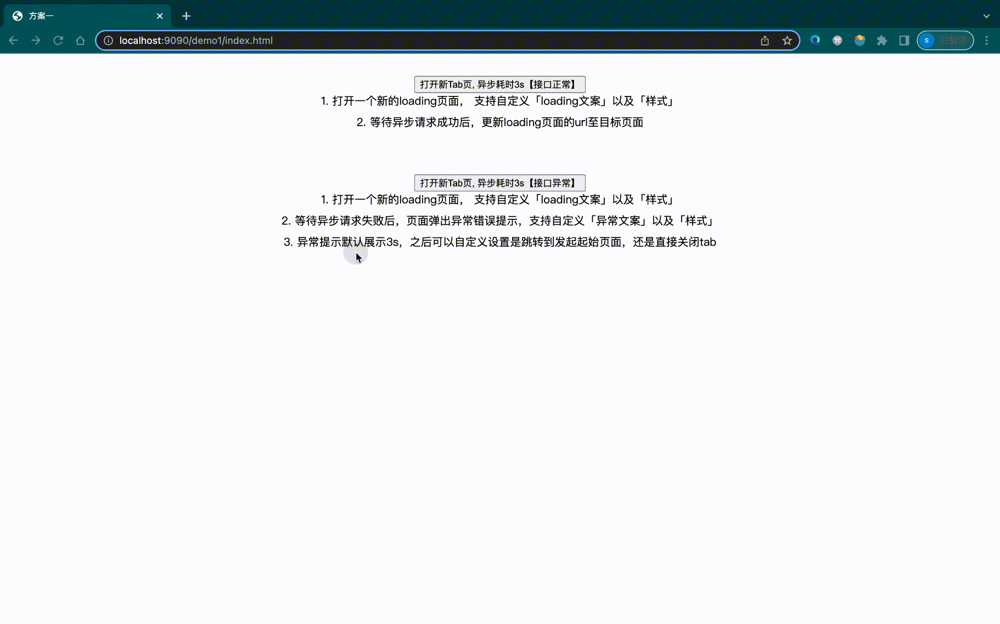

# 背景

浏览器安全策略会限制非用户发起的新 tab 打开，会被浏览器拦截；因此需要针对这种场景做出优化，提升用户体验；
降低页面跳转失败对用户的影响；

# 方案描述

目前使用方案一进行实现

方案一：

1.  window.open 方法的封装， 传入一个异步方法，获取异步方法返回的结果，作为新页面 url 的参数，如何处理看用户
2.  异步方法执行之前打开一个 loading 页面
    a. 若接口成功返回，拿到 url 参数，更新 loading 的 window 对象的 location.href
    b. 若接口执行失败，先给予 loading 页面提示，设置延时，【然后关闭 loading 页面，或者 location.href 设置成原来的 url】

方案二：

1.  通过判断 window.open 执行结果，成功正常跳转；失败给予页面友好提示；可以增加一个 callback 用户自行处理失败后的动作

# 使用方式
